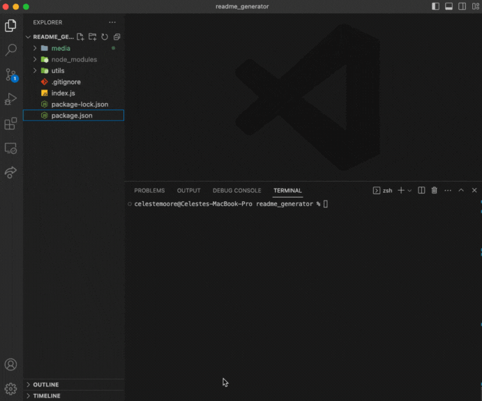

  

  # ReadME.md Generator
  
  ### _This CLI project dynamically creates a readme.md file based off of user input with prompts from promise-based npm package, Inquirer. _
  

  
  ## Table of Contents
  
  - [Description](#Description)
  
  - [Media](#Media)
  
  - [Features](#Features)
  
  - [Contributors](#Contributors)
  
  - [Contact](#Contact)
  
  - [Project Status](#project-status)
  
  - [License](#License)
  
  ## Media
   
    
   
  
  ## Features
  JavaScript, jQuery, Node.js
  
  ## Contributors
  
  This website was created by Celeste Moore.
  
  ## Contact
  
  If you have any questions about this repository, contact celestealexmoore via GitHub or reach out via email:
  celestealexmoore@gmail.com.
  
  ## Project Status
  
  Completed
  
  ---
  
  ## License
  
  
  
  © 2023 _celestealexmoore_

  